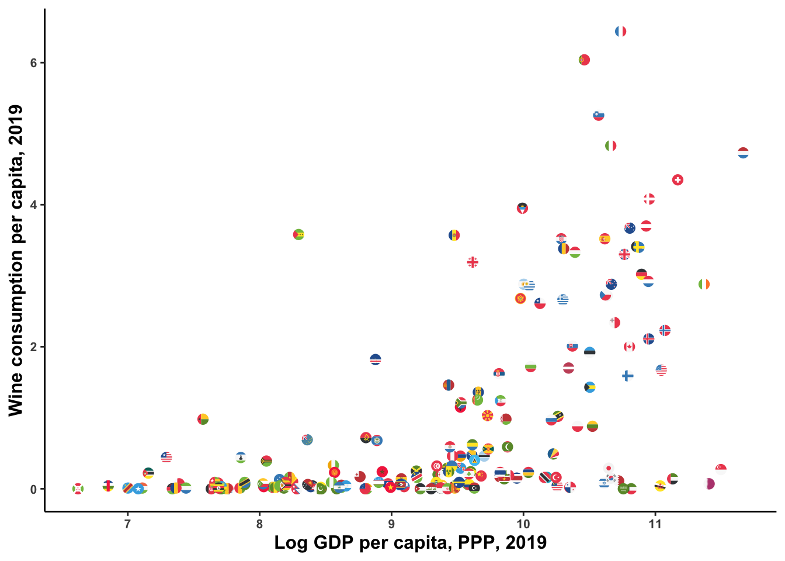

For those looking for an alternative to plotly to create vectorized/interactive graphics keeping ggplot syntax: [ggiraph](https://davidgohel.github.io/ggiraph/#:~:text=ggiraph%20is%20a%20tool%20that,when%20used%20in%20shiny%20applications.) seems to be the solution. Brief example below:


```
## [[1]]
## [1] TRUE
## 
## [[2]]
## [1] TRUE
## 
## [[3]]
## [1] TRUE
## 
## [[4]]
## [1] TRUE
## 
## [[5]]
## [1] TRUE
```




