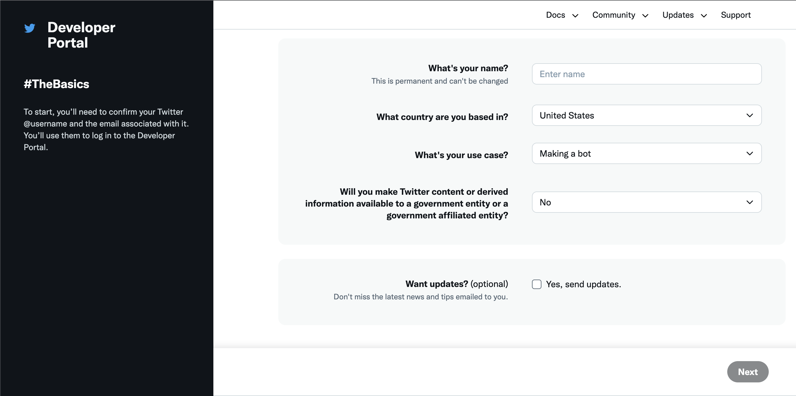
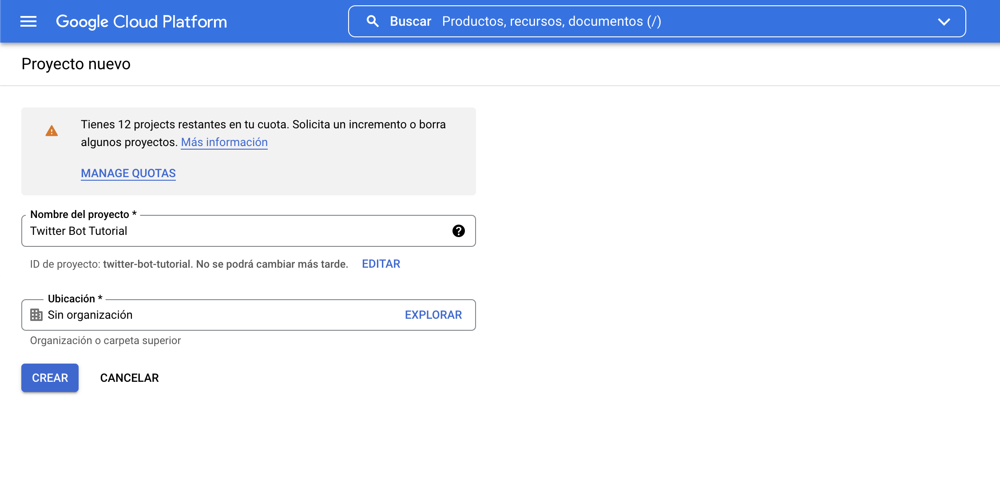

Aun a riesgo de que quede obsoleto pronto [si Elon Musk cumple su promesa de erradicar a los bots de Twitter](https://www.elfinanciero.com.mx/tech/2022/04/25/adios-a-los-bots-elon-musk-reafirma-que-buscara-desaparecer-el-spam-tras-compra-de-twitter/), quería escribir un post sobre cómo programar un bot de Twitter simple en Python y hacerlo correr *serverless* en Google Cloud, una buena alternativa para automatizar un script de Python (o de varios otros lenguajes).

El primer paso es registrarse como desarrollador de Twitter, para tener acceso a la API. Eso se hace en [developer.twitter.com](https://developer.twitter.com/). En esta instancia, Twitter solo hace un par de preguntas y otorga acceso básico a la API de forma casi inmediata sin problemas.



Tras recibir el acceso básico a la API, hay que darle un nombre de la "aplicación" que se va a registrar para recibir las *keys*. 


Una vez que se completa el nombre de la aplicación, aparecerán las *keys*. Es importante guardar bien estas claves, porque son necesarias para interactuar con la API y porque una vez que uno las recibe no las puede volver a ver sin tener que regenerarlas (y así probablemente inutilizar programas que las estén usando).

Una vez que se guardan las *keys*, se accede al portal de desarrollador de Twitter, que se ve como en la imagen de abajo.


Como con el acceso básico a la API no alcanza para poder usar la funcionalidad de postear tweets a través de la API, hay que postularse al acceso "elevado". En esta instancia, Twitter hace unas cuantas preguntas más, principalmente sobre qué funcionalidades utilizará la aplicación y qué uso se les dará a los datos de Twitter que eventualmente se recolecten y descarguen por medio de la API. 

Después de responder esas preguntas y completar la postulación, la aprobación para el acceso "elevado" probablemente permanezca como "pendiente" por un tiempo (en general varias horas, hasta un par de días) e incluso posiblemente sea necesario responder un mail con preguntas adicionales.


Una vez que se reciben las *keys* adicionales del acceso elevado, ya se puede interactuar con la API. Pasamos entonces a escribir el código del bot. En este caso se trata de un bot bastante tonto, que solamente registra qué día es y postea "Hoy es {fecha del día}. Buen día!". Como vamos a hacer el *deployment* del bot en Google Cloud Functions, definimos una función incluyendo todo el código.


```python
def send_tweet(x):
  from datetime import date
  import tweepy

  auth = tweepy.OAuthHandler("CONSUMER_KEY", "CONSUMER_SECRET")
  auth.set_access_token("ACCESS_TOKEN", "ACCESS_TOKEN_SECRET")
  api = tweepy.API(auth)

  hoy = date.today()

  texto_tweet = (f'Hoy es {hoy}. Buen día!')
  api.update_status(status=texto_tweet)
  return 'Tweet posteado!'
```

Ahora pasamos a [Google Cloud Functions](https://console.cloud.google.com/functions?hl=es), donde haremos el *deployment* de nuestra función. Primero debemos crear un nuevo proyecto.



Luego de crear el proyecto, y activar la cuenta, creamos una nueva función. En la configuración básica de la función elegimos activación via HTTP y permitir activaciones sin autenticación, ya que esa es la forma como vamos a ejecutar automáticamente la función: invocándola via HTTP desde un *task scheduler* (usaremos el de Google, pero hay muchos otros).


Luego de guardar la configuración, pasamos al editor del código de la función. Definimos Python como el lenguaje en que estará escrita la función y simplemente pegamos en el editor de texto del código de la función el código que escribimos más arriba. En el documento "requirements.txt" simplemente hay que listar (en distintas líneas) los módulos que la función necesita importar. En este caso sencillo, es solamente "tweepy", la librería que permite interactuar con la API de Twitter. Otro punto importante es que en los campos "CONSUMER_KEY", "CONSUMER_SECRET", "ACCESS_TOKEN" y "ACCESS_TOKEN_SECRET" hay que usar las *keys* que recibimos cuando se aprobó el acceso elevado a la API de Twitter. Para conservar la privacidad de estas claves y mantenerlas ocultas, Cloud functions permite definirlas como variables de entorno, para llamarlas desde el código de la función usando los nombres de esas variables en vez de exponer los caracteres de las *keys*.


Luego de definir el código de la función y clickear "implementar", aparecerá el menú de funciones con nuestra nueva función, como en la imagen de abajo. 


Entramos a nuestra función y, en el menú que se abre, vamos a la pestaña "activador" y copiamos la URL de activación que aparece. A esta altura, con la función ya "implementada", es posible probar que funcione yendo a la pestaña "prueba". Si la función está correctamente programada e implementada, el resultado de la prueba debería ser el tweet posteado.


En este punto, ya tenemos la función programada y activable a través de la URL que copiamos. Necesitamos programar que periódicamente se ejecute la función. Para eso usaremos [Google Cloud Scheduler](https://cloud.google.com/scheduler?hl=es). Creamos un nuevo trabajo y definimos los parámetros básicos de su configuración, como la frecuencia y el huso horario. La frecuencia se define con código CRON (que nunca recuerdo bien cómo escribir, por lo que vienen bien editores online como [este](https://crontab.cronhub.io/) o [este](https://crontab.guru/)). En este caso, definimos que el trabajo se ejecute cada día a las 8 am (en CRON: 0 8 * * *).


En el siguiente paso definimos como tipo de destino "HTTP", ya que ese es el tipo de activación que elegimos para la función en Cloud Functions, y pegamos la URL de activación que antes copiamos en Cloud Functions. Definimos POST como el método HTTP, sin encabezado.


En la página siguiente se puede definir la cantidad de reintentos en caso de error y el tiempo de espera entre ellos. No importa mucho qué definamos acá, yo he experimentado con distintas combinaciones de valores, pero la API de Twitter es bastante estable y los errores son poco frecuentes, por lo que estas opciones rara vez son relevantes en la medida que el código de la función solo implique consultas a la API de Twitter.

Tras crear el trabajo, lo veremos en el menú de trabajos, programado para ejecutarse cada día a las 8 am.


Con esto, el bot ya está programado e implementado como función en Google Cloud Functions, y la función está programada para ejecutarse todos los días a las 8 am por medio de Cloud Scheduler. Este tipo de implementación *serverless* permite que el bot se ejecute todos los días de forma automática sin necesidad de tener una máquina encendida para hacerlo como en las implementaciones locales.


