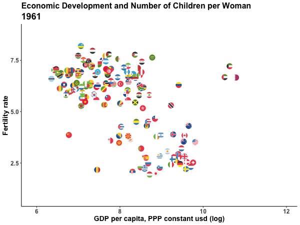

Animations are becoming a popular way to plot data, as they allow to increase the dimensionality of a graph. If static graphs can plot data along spatial dimensions (the axis, size of geometries) or along visual dimensions (colors, shapes), animations allow for one more: some variation can be shown with the changes across different frames.

To show an example of this, I downloaded data on [fertility rate](https://ourworldindata.org/fertility-rate) (the number of children born alive to women of that age during the year as a proportion of the average annual population of women of the same age) by country and year, and data on [GDP per capita](https://ourworldindata.org/economic-growth). Both datasets can be downloaded from [Our World in Data](https://ourworldindata.org/). 


```r
lapply(c("tidyverse", "janitor", "gganimate",
         "ggflags", "lubridate", "countrycode"), require, character.only=T)

pop <- read_csv("population.csv") %>% 
  clean_names() %>% rename(population = population_historical_estimates) %>% 
  mutate(code = countrycode(code, origin="iso3c", destination = "iso2c") %>% tolower())

fert <- read_csv("children-per-woman-UN.csv") %>% 
  clean_names() %>% 
  rename(fertility = fertility_rate_sex_all_age_all_variant_estimates) %>% 
  mutate(code = countrycode(code, origin="iso3c", destination = "iso2c") %>% tolower())

dev <- read_csv("gdp-per-capita-maddison-2020.csv") %>% 
  clean_names() %>% 
  mutate(code = countrycode(code, origin="iso3c", destination = "iso2c") %>% tolower()) %>% 
  rename(gdppc = gdp_per_capita)
```

Some facts are well known about this. First, the fertility rate has been in sharp decline around the world for many years now. 70 years ago, the average woman had at least five children, and often more. Since then, that number has fallen by half. Second, fertility rate correlates negatively with economic development -- causality operates through many different mechanisms, like higher female labor force participation, structural transformation, access to contraception, women's empowerment, etc, but that exceeds the scope of this post. Both relationships can be shown with simple bivariate plots:


```r
fert %>% 
  left_join(pop) %>% 
  filter(year %in% c(1990, 2021) & 
           is.na(code) == FALSE &
           population>1000000) %>%
  select(-population) %>% 
  mutate(year = paste0("fert_", year)) %>% 
  pivot_wider(names_from = year, 
              values_from = fertility)  %>% 
  ggplot(aes(x=fert_1990, y=fert_2021)) +
  geom_flag(aes(country=code), show.legend = FALSE, size=4) +
  # scale_size_continuous(limits = c(4, 8))+
  geom_abline(slope = 1, intercept = 0, linetype="dashed", color="gray44") +
  scale_x_continuous(breaks=0:9, limits=c(0,9)) +
  scale_y_continuous(breaks=0:9, limits=c(0,9)) +
  theme_classic() +
    theme(axis.text = element_text(face="bold", size=12), 
        axis.title = element_text(face="bold", size=14), 
        plot.title = element_text(face="bold", size=16), 
        plot.subtitle = element_text(face="bold", size=18)) +
  labs(x="Fertility rate, 1990", y="Fertility rate, 2021", 
       title = "Fertility rate by country in 1990 and 2021")
```

}}index.en_files/figure-html/unnamed-chunk-3-1.png" width="672" />


```r
fert %>% 
  left_join(dev, by=c("code", "year")) %>% 
  mutate(log_gdp = log(gdppc), 
         year=as.integer(year)) %>% 
  filter(year==2018) %>% 
  ggplot(aes(x=log_gdp, y=fertility)) +
  geom_flag(aes(country=code), show.legend = FALSE, size=4) +
 theme_classic() +
    theme(axis.text = element_text(face="bold", size=12), 
        axis.title = element_text(face="bold", size=14), 
        plot.title = element_text(face="bold", size=16), 
        plot.subtitle = element_text(face="bold", size=18)) +
  labs(x="GDP per capita, PPP", y="Fertility rate", 
       title = "Income level and Fertility rate, 2018")
```

}}index.en_files/figure-html/unnamed-chunk-4-1.png" width="672" />

Using an animated plot, I can show all three variables (income, time and fertility rate) in the same graph, keeping income and fertility rate on the axes and showing the change in time across different frames. The grammar of the [*gganimate*](https://gganimate.com) package is straightforward. All that is needed is an additional argument in the `ggplot()` framework, from the [`transition_`](https://gganimate.com/reference/index.html) family, to declare how plot data should be interpreted in terms of the animations dimension. In this case, since year is a numeric variable that measures time, the [`transition_time()`](https://gganimate.com/reference/transition_time.html) is best suited for the job, as it is intended for data where the states are representing specific point in time, and therefore the transition length between the states will be set to correspond to the actual time difference between them. Other functions can be added to customize the way the animation is rendered, but they are optional. In this case, I first create a gganimate object and then animate it using the `animate()` function, to be able to specify the number of frames and size of the animation, but it is not strictly necessary to add this extra step.


```r
fert %>% 
  left_join(dev, by=c("code", "year")) %>% 
  mutate(log_gdp = log(gdppc), 
         year=as.integer(year)) %>% 
  filter(year>1960 & year<2019) %>% 
  ggplot(aes(x=log_gdp, y=fertility)) +
  geom_flag(aes(country = code)) +
  theme_classic() +
  labs(title="Economic Development and Number of Children per Woman",
       subtitle = "{frame_time}",
       x="GDP per capita, PPP constant usd (log)",
       y="Fertility rate") +
  theme(axis.text = element_text(face="bold", size=12), 
        axis.title = element_text(face="bold", size=14), 
        plot.title = element_text(face="bold", size=16), 
        plot.subtitle = element_text(face="bold", size=18)) +
  transition_time(year) +
  ease_aes('linear')-> fertility_plot

animate(fertility_plot,width=600, height=450, 
        nframes = 200, end_pause = 20)
```

<!-- -->


